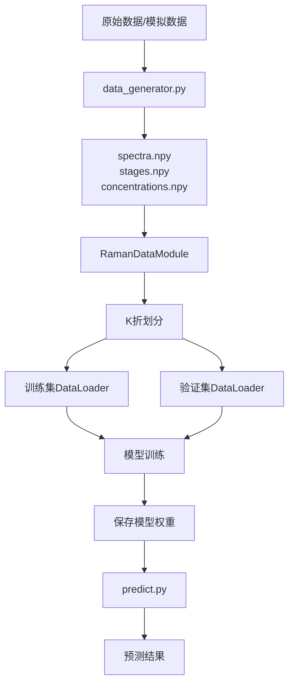

# 一维卷积神经网络拉曼谱图分析系统 - 使用指南

> 完整的项目使用说明，适合初学者和有经验的开发者

## 📖 如何阅读本文档

**根据您的经验水平选择阅读路径：**

### 🚀 快速上手路径（5分钟，适合有经验的开发者）
1. [快速开始](#快速开始) - 三步启动
2. [核心命令速查](#核心命令速查) - 常用命令

### 📚 完整学习路径（适合初学者）
1. [项目简介](#项目简介) - 了解项目背景
2. [快速开始](#快速开始) - 运行第一个示例
3. [详细使用教程](#详细使用教程) - 逐步学习
4. [输出结果解读](#输出结果解读) - 理解结果含义
5. [常见问题](#常见问题) - 遇到问题时查阅

### 🔧 开发定制路径（适合需要修改的开发者）
1. [项目架构解析](#项目架构解析) - 理解代码结构
2. [参数配置详解](#参数配置详解) - 调整模型参数
3. [开发者指南](#开发者指南) - 扩展功能

---

## 📋 目录

- [项目简介](#项目简介)
- [快速开始](#快速开始)
- [核心命令速查](#核心命令速查)
- [详细使用教程](#详细使用教程)
- [输出结果解读](#输出结果解读)
- [项目架构解析](#项目架构解析)
- [参数配置详解](#参数配置详解)
- [开发者指南](#开发者指南)
- [常见问题](#常见问题)
- [性能优化建议](#性能优化建议)

---

## 项目简介

### 项目背景

拉曼光谱是一种重要的分析技术，广泛应用于化学、生物、材料等领域。本项目使用深度学习方法分析拉曼谱图，实现：
- **分类任务**：识别发酵的不同阶段（1-10）
- **回归任务**：预测化学成分浓度（10种成分）

### 技术特点

- **多任务学习**：同时完成分类和回归任务
- **双模型对比**：1D-CNN vs 1D-ResNet18
- **五折交叉验证**：确保模型泛化能力
- **完整工作流**：数据生成 → 模型训练 → 结果预测

### 适用场景

- ✅ 深度学习课程教学
- ✅ 拉曼谱图分析研究
- ✅ PyTorch框架学习
- ✅ 多任务学习实践
- ✅ 一维信号处理参考

### 前置要求

**必须**：
- 已完成环境配置（参见[环境配置.md](环境配置.md)）
- 基本的命令行操作知识

**推荐**（非必须）：
- 了解Python基础语法
- 了解深度学习基本概念
- 了解卷积神经网络原理

---

## 快速开始

### 三步启动流程

```bash
# 步骤1：激活环境
conda activate raman_cnn

# 步骤2：进入项目目录
cd /d "项目路径"

# 步骤3：运行快速测试
python quick_start.py
```

**预期时间**：约30秒
**预期输出**：模型架构信息、数据统计、预测演示

### 完整工作流

```bash
# 1. 快速测试（验证环境）
python quick_start.py

# 2. 训练模型（40-50分钟）
python train.py

# 3. 使用模型预测
python predict.py
```

---

## 核心命令速查

### 基础操作

```bash
# 环境激活
conda activate raman_cnn

# 快速测试
python quick_start.py

# 训练模型
python train.py

# 预测
python predict.py
```

### 查看帮助

```python
# 在Python交互环境中
import config
print(config.CNN_CONFIG)      # 查看CNN配置
print(config.RESNET_CONFIG)   # 查看ResNet配置
print(config.DATA_CONFIG)     # 查看数据配置
```

### 文件结构速览

```
项目根目录/
├── config.py           # 配置文件（修改参数）
├── train.py            # 训练脚本（运行训练）
├── predict.py          # 预测脚本（使用模型）
├── quick_start.py      # 快速演示（测试环境）
├── models/             # 模型定义
├── data/               # 数据处理
├── utils/              # 工具函数
├── saved_models/       # 训练好的模型（训练后生成）
└── results/            # 训练结果（训练后生成）
```

---

## 详细使用教程

### 步骤1：快速测试程序

**目的**：验证环境配置是否正确，熟悉项目功能

#### 运行命令

```bash
python quick_start.py
```

#### 程序流程

程序会依次演示：
1. **数据生成**：生成100个模拟拉曼谱图样本
2. **模型架构**：展示CNN和ResNet模型信息
3. **前向传播**：演示模型的输入输出
4. **单样本预测**：展示预测流程

#### 输出示例

```
================================================================================
拉曼谱图一维卷积神经网络分析系统 - 快速开始
================================================================================

1. 数据生成演示
   - 生成100个样本
   - 显示数据统计信息

生成的数据:
  谱图形状: (100, 1015)
  阶段标签形状: (100,)
  浓度标签形状: (100, 10)

2. 模型架构演示
   
1D-CNN 模型:
  model_name: 1D-CNN
  total_parameters: 8660234
  input_dim: 1015
  num_classes: 10
  num_targets: 10

...

快速开始演示完成！
```

#### 重点说明

- **数据形状**：
  - `(100, 1015)`：100个样本，每个有1015个特征点
  - `(100,)`：100个阶段标签（0-9）
  - `(100, 10)`：100个样本，每个有10个浓度值

- **模型参数**：
  - CNN约860万参数
  - ResNet约410万参数（使用残差连接，效率更高）

- **运行时间**：约30秒

---

### 步骤2：训练模型

**目的**：训练神经网络模型，学习拉曼谱图的模式

#### 运行命令

```bash
python train.py
```

#### 训练流程详解

##### 第一阶段：数据准备

```
正在生成 1000 个样本...
数据集已保存到 data/
  谱图形状: (1000, 1015)
  阶段标签形状: (1000,)
  浓度标签形状: (1000, 10)
```

**说明**：
- 自动生成1000个模拟拉曼谱图
- 包含10个发酵阶段，10种化学成分
- 数据保存后，后续运行会直接加载

##### 第二阶段：模型训练

程序会依次训练两个模型：
1. **1D-CNN模型**（5折交叉验证）
2. **1D-ResNet18模型**（5折交叉验证）

每折训练输出示例：

```
================================================================================
开始训练 CNN 模型 - 折 1
================================================================================

模型信息:
  model_name: 1D-CNN
  total_parameters: 8660234
  trainable_parameters: 8660234

Epoch [1/100]
--------------------------------------------------------------------------------
  Batch [10/25] | Loss: 2.3456 | Class: 1.2345 | Reg: 1.1111
  Batch [20/25] | Loss: 2.1234 | Class: 1.1234 | Reg: 1.0000

训练 | Loss: 2.0123 | Class: 1.0567 | Reg: 0.9556
验证 | Loss: 1.9234 | Class: 1.0123 | Reg: 0.9111
验证 | Accuracy: 0.3500 | R²: 0.2345
时间: 1.2s | 学习率: 0.001000
✓ 保存最佳模型到: saved_models/cnn_1d_fold_0.pth

Epoch [2/100]
...
```

**输出指标说明**：

| 指标 | 含义 | 期望趋势 |
|------|------|----------|
| Loss | 总损失 | 逐渐下降 |
| Class | 分类损失 | 逐渐下降 |
| Reg | 回归损失 | 逐渐下降 |
| Accuracy | 分类准确率 | 逐渐上升 |
| R² | 回归决定系数 | 逐渐上升（接近1） |

**训练策略**：
- **早停机制**：验证损失15个epoch不改善则停止
- **学习率调度**：验证损失10个epoch不改善则降低学习率
- **最佳模型保存**：自动保存验证损失最低的模型

##### 第三阶段：训练总结

```
====================================================================================================
5折交叉验证平均结果:
====================================================================================================

分类指标:
  准确率: 0.8523 ± 0.0234
  F1分数: 0.8456

回归指标:
  R²: 0.9123 ± 0.0156
  MAE: 3.45
  RMSE: 4.78

结果已保存到: results/cnn_kfold_results.json
学习曲线已保存到: results/cnn_learning_curves.png
```

**结果文件**：
- `saved_models/cnn_1d_fold_*.pth`：5个模型权重文件
- `saved_models/resnet_1d_fold_*.pth`：5个模型权重文件
- `results/cnn_kfold_results.json`：CNN性能统计
- `results/resnet_kfold_results.json`：ResNet性能统计
- `results/cnn_learning_curves.png`：CNN学习曲线图
- `results/resnet_learning_curves.png`：ResNet学习曲线图

#### 训练时间

| 阶段 | CPU时间 | GPU时间 |
|------|---------|---------|
| 数据生成 | < 1分钟 | < 1分钟 |
| CNN训练（5折） | 15-20分钟 | 3-5分钟 |
| ResNet训练（5折） | 25-30分钟 | 5-8分钟 |
| **总计** | **40-50分钟** | **8-14分钟** |

#### 注意事项

1. **训练期间**：
   - 可以继续使用电脑
   - 避免进入睡眠模式
   - CPU使用率较高属于正常现象

2. **中断恢复**：
   - 如果训练中断，需要重新运行
   - 建议备份已训练的模型文件

3. **内存不足**：
   - 如果内存不足，修改`config.py`中的`BATCH_SIZE`
   - 例如：`BATCH_SIZE = 16`（默认32）

---

### 步骤3：使用模型预测

**前提**：必须完成步骤2的模型训练

#### 运行命令

```bash
python predict.py
```

#### 预测功能演示

程序包含三个演示示例：

##### 示例1：单个样本预测

使用单个模型对一个样本进行预测：

```
================================================================================
示例 1: 单个样本预测
================================================================================

真实标签:
  发酵阶段: 阶段7
  化学成分浓度: [73.93 63.67 77.59 ... ]

使用 1D-CNN 模型预测:
成功加载模型: saved_models/cnn_1d_fold_0.pth
模型训练轮数: 45
验证损失: 1.2345
分类准确率: 0.8523
回归R²: 0.9123

预测结果
================================================================================
发酵阶段预测: 阶段7 (置信度: 87.34%)

各阶段概率分布:
  阶段1      | ████                                             2.34%
  阶段2      | ███                                              1.23%
  阶段3      | ████                                             2.56%
  阶段4      | ████                                             2.89%
  阶段5      | █████                                            3.12%
  阶段6      | ████████                                         5.67%
  阶段7      | ████████████████████████████████████████████     87.34%
  阶段8      | ████                                             2.45%
  阶段9      | ███                                              1.78%
  阶段10     | ███                                              1.62%

化学成分浓度预测 (mg/L):
--------------------------------------------------------------------------------
  儿茶素C                : 72.45 mg/L
  EGCG                :  62.34 mg/L
  咖啡因                 :  76.89 mg/L
  茶氨酸                 :  68.23 mg/L
  表儿茶素              :  71.56 mg/L
  表没食子儿茶素        :  69.87 mg/L
  没食子酸              :  74.12 mg/L
  茶黄素                :  70.45 mg/L
  茶红素                :  72.89 mg/L
  可溶性糖              :  75.23 mg/L
================================================================================
```

##### 示例2：集成预测

使用多个模型（2个模型×5折=10个模型）进行集成预测：

```
================================================================================
示例 2: 集成预测 (多模型多折)
================================================================================

使用 2 个模型和 5 折进行集成预测...
✓ CNN Fold 1: 阶段 7, 置信度 85.23%
✓ CNN Fold 2: 阶段 7, 置信度 86.45%
✓ CNN Fold 3: 阶段 7, 置信度 88.12%
✓ CNN Fold 4: 阶段 7, 置信度 87.90%
✓ CNN Fold 5: 阶段 7, 置信度 86.78%
✓ RESNET Fold 1: 阶段 7, 置信度 89.34%
✓ RESNET Fold 2: 阶段 7, 置信度 88.67%
✓ RESNET Fold 3: 阶段 7, 置信度 89.91%
✓ RESNET Fold 4: 阶段 7, 置信度 88.45%
✓ RESNET Fold 5: 阶段 7, 置信度 89.12%

集成预测结果
================================================================================
发酵阶段: 阶段7 (置信度: 87.52%)

化学成分浓度 (mg/L):
--------------------------------------------------------------------------------
  儿茶素C                : 72.15 ±  1.23 mg/L
  EGCG                :  62.89 ±  0.98 mg/L
  咖啡因                 :  76.45 ±  1.45 mg/L
  茶氨酸                 :  68.67 ±  1.12 mg/L
  表儿茶素              :  71.23 ±  1.34 mg/L
  ...
================================================================================
```

**集成预测的优势**：
- 更稳定的预测结果
- 提供不确定性估计（±值）
- 降低单个模型的偏差

##### 示例3：测试集评估

在测试集上系统评估模型性能：

```
================================================================================
示例 3: 测试集评估
================================================================================

在测试集上评估 CNN 模型 (Fold 0)...
正在预测测试集...

============================================================
分类指标:
============================================================
准确率 (Accuracy):          0.8523
精确率 (Precision-Macro):   0.8456
召回率 (Recall-Macro):      0.8390
F1分数 (F1-Macro):          0.8423
精确率 (Precision-Weighted): 0.8567
召回率 (Recall-Weighted):   0.8523
F1分数 (F1-Weighted):       0.8489

============================================================
回归指标:
============================================================
平均绝对误差 (MAE):   3.45
均方误差 (MSE):        16.23
均方根误差 (RMSE):     4.78
决定系数 (R²):         0.9123

每个化学成分的指标:
------------------------------------------------------------
儿茶素C                 | MAE: 3.21 | RMSE: 4.56 | R²: 0.915
EGCG                 | MAE: 3.45 | RMSE: 4.89 | R²: 0.923
咖啡因                 | MAE: 3.67 | RMSE: 5.12 | R²: 0.908
...
============================================================
```

---

## 输出结果解读

### 训练过程指标

#### 损失函数（Loss）

**总损失**：
$$L_{total} = \alpha \cdot L_{classification} + \beta \cdot L_{regression}$$

式中，$\alpha$是分类损失权重；$\beta$是回归损失权重；$L_{classification}$是分类损失；$L_{regression}$是回归损失。

**意义**：
- 损失越小，模型拟合越好
- 正常情况下，训练损失和验证损失都应该下降
- 如果验证损失不再下降，可能出现过拟合

#### 分类指标

**准确率（Accuracy）**：
- 定义：预测正确的样本数 / 总样本数
- 范围：0-1，越大越好
- 期望：>0.8（80%以上）

**F1分数**：
- 综合考虑精确率和召回率
- 适用于类别不平衡的情况
- 范围：0-1，越大越好

#### 回归指标

**R²（决定系数）**：
- 定义：模型解释的方差占比
- 范围：0-1，越接近1越好
- 期望：>0.9（解释90%以上的方差）

**MAE（平均绝对误差）**：
- 定义：预测值与真实值的平均绝对差
- 单位：与目标变量相同（mg/L）
- 越小越好

**RMSE（均方根误差）**：
- 定义：预测误差的均方根
- 对大误差更敏感
- 越小越好

### 学习曲线分析

训练完成后生成的学习曲线图（`results/*_learning_curves.png`）包含4个子图：

1. **总损失曲线**：
   - 蓝色：训练损失
   - 橙色：验证损失
   - 正常：都应该下降且趋于收敛

2. **分类损失曲线**：
   - 显示分类任务的损失变化
   - 应该逐渐下降

3. **回归损失曲线**：
   - 显示回归任务的损失变化
   - 应该逐渐下降

4. **准确率和R²曲线**：
   - 实线：准确率
   - 虚线：R²
   - 都应该逐渐上升

**异常情况识别**：
- **过拟合**：训练损失下降，验证损失上升
- **欠拟合**：训练损失和验证损失都很高
- **震荡**：损失波动很大，可能学习率太高

---

## 项目架构解析

### 目录结构详解

```
卷积神经网络（CNN）在特征局部模式识别中的优势/
│
├── config.py                    # 全局配置文件
│   ├── 数据配置（INPUT_DIM, NUM_CLASSES等）
│   ├── 模型配置（CNN_CONFIG, RESNET_CONFIG）
│   ├── 训练配置（BATCH_SIZE, EPOCHS等）
│   └── 路径配置（数据、模型、结果保存路径）
│
├── train.py                     # 训练主脚本
│   ├── Trainer类：训练器实现
│   ├── train_with_k_fold()：K折交叉验证
│   └── plot_learning_curves()：绘制学习曲线
│
├── predict.py                   # 预测主脚本
│   ├── Predictor类：预测器实现
│   ├── ensemble_predict()：集成预测
│   └── evaluate_test_set()：测试集评估
│
├── quick_start.py               # 快速演示脚本
│   ├── 数据生成演示
│   ├── 模型架构展示
│   ├── 前向传播测试
│   └── 预测流程演示
│
├── models/                      # 模型定义模块
│   ├── __init__.py
│   ├── cnn_1d.py               # 1D-CNN模型
│   │   ├── CNN1D类：模型架构
│   │   └── create_cnn_model()：工厂函数
│   │
│   └── resnet_1d.py            # 1D-ResNet18模型
│       ├── BasicBlock1D类：残差块
│       ├── ResNet1D类：模型架构
│       └── create_resnet_model()：工厂函数
│
├── data/                        # 数据处理模块
│   ├── __init__.py
│   ├── data_generator.py       # 数据生成器
│   │   ├── RamanDataGenerator类
│   │   └── load_or_generate_data()：数据加载
│   │
│   ├── spectra.npy             # 拉曼谱图数据（运行后生成）
│   ├── stages.npy              # 阶段标签（运行后生成）
│   └── concentrations.npy      # 浓度标签（运行后生成）
│
├── utils/                       # 工具函数模块
│   ├── __init__.py
│   ├── dataset.py              # PyTorch数据集类
│   │   ├── RamanDataset：数据集类
│   │   └── RamanDataModule：数据模块
│   │
│   └── metrics.py              # 评估指标
│       ├── MetricsCalculator：指标计算器
│       └── calculate_loss()：损失计算
│
├── saved_models/                # 模型权重保存目录（训练后生成）
│   ├── cnn_1d_fold_0.pth
│   ├── cnn_1d_fold_1.pth
│   ├── ...
│   └── resnet_1d_fold_4.pth
│
├── results/                     # 训练结果保存目录（训练后生成）
│   ├── cnn_kfold_results.json
│   ├── cnn_learning_curves.png
│   ├── resnet_kfold_results.json
│   └── resnet_learning_curves.png
│
├── logs/                        # 日志目录
│
├── docs/                        # 文档目录
│   ├── 环境配置.md
│   └── 使用指南.md（本文档）
│
├── requirements.txt             # Python依赖列表
├── README.md                    # 项目简介
└── 使用指南.md                  # 使用指南（主目录版本）
```

### 数据流向



### 模型架构

#### 1D-CNN架构

```
输入 (1, 1015)
    ↓
卷积层1 (32通道, kernel=7) + BN + ReLU + MaxPool
    ↓
卷积层2 (64通道, kernel=5) + BN + ReLU + MaxPool
    ↓
卷积层3 (128通道, kernel=3) + BN + ReLU + MaxPool
    ↓
卷积层4 (256通道, kernel=3) + BN + ReLU + MaxPool
    ↓
展平 → 全连接层 (512) + BN + ReLU + Dropout
    ↓
    ├─→ 分类头 → (10) [发酵阶段]
    └─→ 回归头 → (10) [化学成分浓度]
```

**特点**：
- 4层卷积，逐层提取特征
- BatchNorm加速训练
- Dropout防止过拟合
- 多任务输出

#### 1D-ResNet18架构

```
输入 (1, 1015)
    ↓
初始卷积 (64通道, kernel=7, stride=2) + BN + ReLU + MaxPool
    ↓
残差层1 (64通道, 2个BasicBlock)
    ↓
残差层2 (128通道, 2个BasicBlock, stride=2)
    ↓
残差层3 (256通道, 2个BasicBlock, stride=2)
    ↓
残差层4 (512通道, 2个BasicBlock, stride=2)
    ↓
全局平均池化
    ↓
    ├─→ 分类头 → (10) [发酵阶段]
    └─→ 回归头 → (10) [化学成分浓度]
```

**特点**：
- 残差连接解决梯度消失
- 参数量更少（4.1M vs 8.7M）
- 性能通常更好
- 训练更稳定

---

## 参数配置详解

所有配置参数在`config.py`文件中集中管理。

### 数据配置

```python
# 输入维度
INPUT_DIM = 1015  # 拉曼谱图特征点数量

# 分类任务
NUM_CLASSES = 10  # 发酵阶段数量
CLASS_NAMES = ["阶段1", "阶段2", ..., "阶段10"]

# 回归任务
NUM_TARGETS = 10  # 化学成分数量
TARGET_NAMES = ["儿茶素C", "EGCG", "咖啡因", ...]
```

**修改场景**：
- 如果您的数据有不同数量的特征点，修改`INPUT_DIM`
- 如果分类类别不同，修改`NUM_CLASSES`和`CLASS_NAMES`
- 如果回归目标不同，修改`NUM_TARGETS`和`TARGET_NAMES`

### 模型配置

#### CNN配置

```python
CNN_CONFIG = {
    'conv_channels': [32, 64, 128, 256],  # 各卷积层通道数
    'kernel_sizes': [7, 5, 3, 3],         # 各卷积层卷积核大小
    'pool_sizes': [2, 2, 2, 2],           # 各池化层大小
    'dropout_rate': 0.5,                   # Dropout比率
    'fc_hidden_dim': 512,                  # 全连接层维度
}
```

**调整建议**：

| 参数 | 增大效果 | 减小效果 | 推荐值 |
|------|----------|----------|--------|
| conv_channels | 提取更多特征，但计算量大 | 减少参数，训练快 | [32,64,128,256] |
| dropout_rate | 更强的正则化，防止过拟合 | 可能过拟合 | 0.3-0.5 |
| fc_hidden_dim | 更强的表达能力 | 减少参数 | 256-512 |

#### ResNet配置

```python
RESNET_CONFIG = {
    'initial_channels': 64,                      # 初始卷积层通道数
    'block_channels': [64, 128, 256, 512],       # 各残差层组通道数
    'num_blocks': [2, 2, 2, 2],                  # 各残差层组的块数量
    'dropout_rate': 0.5,
}
```

**调整建议**：
- `num_blocks=[2,2,2,2]`对应ResNet18
- `num_blocks=[3,4,6,3]`对应ResNet34
- 增加块数可提高性能但训练时间更长

### 训练配置

```python
# 基本训练参数
BATCH_SIZE = 32              # 批次大小
EPOCHS = 100                 # 最大训练轮数
LEARNING_RATE = 0.001        # 学习率
WEIGHT_DECAY = 1e-4          # 权重衰减（L2正则化）

# 早停策略
EARLY_STOPPING_PATIENCE = 15  # 早停耐心值

# 学习率调度
LR_SCHEDULER = {
    'type': 'ReduceLROnPlateau',
    'factor': 0.5,            # 学习率衰减因子
    'patience': 10,           # 衰减前的等待轮数
    'min_lr': 1e-6,          # 最小学习率
}

# 交叉验证
K_FOLDS = 5                  # 五折交叉验证
```

**参数调整指南**：

#### BATCH_SIZE（批次大小）

- **增大**：训练更快，但需要更多内存
- **减小**：内存不足时必须减小
- **推荐值**：
  - 8GB内存：16-32
  - 16GB内存：32-64
  - 32GB内存：64-128

#### LEARNING_RATE（学习率）

- **增大**：收敛更快，但可能不稳定
- **减小**：训练更稳定，但收敛慢
- **推荐值**：
  - Adam优化器：0.001（默认）
  - SGD优化器：0.01-0.1
  - 如果loss震荡：减小到0.0001

#### EPOCHS（训练轮数）

- 实际轮数由早停机制控制
- 设置较大值（如100）确保充分训练
- 快速测试可设为20-30

#### K_FOLDS（交叉验证折数）

- 5折：平衡性能评估和训练时间
- 3折：快速验证
- 10折：更准确的性能评估，但训练时间长

### 数据生成配置

```python
DATA_CONFIG = {
    'num_samples': 1000,                    # 总样本数
    'noise_level': 0.05,                    # 噪声水平
    'peak_intensity_range': (0.1, 1.0),    # 峰强度范围
    'concentration_range': (0.0, 100.0),   # 浓度范围（mg/L）
    'random_seed': 42,                      # 随机种子
}
```

**修改场景**：
- **num_samples**：更多样本提高模型性能，但训练时间增加
- **noise_level**：增加噪声模拟真实数据
- **random_seed**：改变种子生成不同的数据分布

### 设备配置

```python
DEVICE_MODE = 'cpu'  # 'cpu', 'cuda', 'auto'
```

**选项说明**：
- `'cpu'`：强制使用CPU（默认，最稳定）
- `'cuda'`：强制使用GPU（需要CUDA支持）
- `'auto'`：自动检测GPU，不可用时回退到CPU

**GPU使用**：
- 如果有NVIDIA GPU且已安装CUDA
- 修改为`'auto'`或`'cuda'`
- 训练速度可提升5-10倍

---

## 开发者指南

### 如何添加新模型

#### 步骤1：创建模型文件

在`models/`目录下创建新文件，例如`lstm_cnn.py`：

```python
"""
LSTM+CNN混合模型
"""
import torch
import torch.nn as nn
import config

class LSTMCNN(nn.Module):
    def __init__(self, input_dim=1015, num_classes=10, num_targets=10):
        super(LSTMCNN, self).__init__()
        
        # LSTM层
        self.lstm = nn.LSTM(
            input_size=1,
            hidden_size=64,
            num_layers=2,
            batch_first=True,
            bidirectional=True
        )
        
        # CNN层
        self.conv = nn.Sequential(
            nn.Conv1d(128, 64, kernel_size=3, padding=1),
            nn.ReLU(),
            nn.MaxPool1d(2)
        )
        
        # 分类头
        self.classifier = nn.Linear(64 * (input_dim // 2), num_classes)
        
        # 回归头
        self.regressor = nn.Linear(64 * (input_dim // 2), num_targets)
    
    def forward(self, x):
        # x: (batch, 1, input_dim)
        x = x.squeeze(1).unsqueeze(2)  # (batch, input_dim, 1)
        
        # LSTM
        lstm_out, _ = self.lstm(x)  # (batch, input_dim, 128)
        
        # CNN
        conv_out = self.conv(lstm_out.transpose(1, 2))  # (batch, 64, input_dim/2)
        
        # 展平
        flat = conv_out.view(conv_out.size(0), -1)
        
        # 输出
        class_output = self.classifier(flat)
        reg_output = self.regressor(flat)
        
        return class_output, reg_output
    
    def get_model_info(self):
        total_params = sum(p.numel() for p in self.parameters())
        return {
            'model_name': 'LSTM-CNN',
            'total_parameters': total_params,
        }

def create_lstm_cnn_model():
    return LSTMCNN(
        input_dim=config.INPUT_DIM,
        num_classes=config.NUM_CLASSES,
        num_targets=config.NUM_TARGETS
    )
```

#### 步骤2：在config.py中添加配置

```python
# LSTM-CNN配置
LSTMCNN_CONFIG = {
    'lstm_hidden': 64,
    'lstm_layers': 2,
    'conv_channels': 64,
    'dropout_rate': 0.5,
}
```

#### 步骤3：在train.py中集成

```python
from models.lstm_cnn import create_lstm_cnn_model

# 在train_with_k_fold函数中添加
def train_with_k_fold(model_name='cnn', k_folds=5):
    ...
    # 创建模型
    if model_name == 'cnn':
        model = create_cnn_model()
    elif model_name == 'resnet':
        model = create_resnet_model()
    elif model_name == 'lstmcnn':  # 新增
        model = create_lstm_cnn_model()
    ...

# 在主函数中添加训练调用
if __name__ == '__main__':
    ...
    # 训练LSTM-CNN模型
    print("\n开始训练 LSTM-CNN 模型...")
    lstmcnn_results = train_with_k_fold(model_name='lstmcnn', k_folds=config.K_FOLDS)
```

### 如何使用自己的数据

#### 方法1：修改数据生成器

编辑`data/data_generator.py`：

```python
def load_real_data(data_path):
    """
    加载真实拉曼谱图数据
    
    Args:
        data_path: 数据文件路径
    
    Returns:
        spectra: (N, 1015) 谱图数据
        stages: (N,) 阶段标签
        concentrations: (N, 10) 浓度标签
    """
    # 根据您的数据格式加载
    # 示例：CSV格式
    import pandas as pd
    df = pd.read_csv(data_path)
    
    spectra = df.iloc[:, :1015].values  # 前1015列为谱图
    stages = df['stage'].values          # stage列为阶段
    concentrations = df.iloc[:, 1016:1026].values  # 后10列为浓度
    
    return spectra, stages, concentrations
```

#### 方法2：准备标准格式数据

将您的数据保存为numpy格式：

```python
import numpy as np

# 准备您的数据
your_spectra = ...        # shape: (N, 1015)
your_stages = ...         # shape: (N,)
your_concentrations = ... # shape: (N, 10)

# 保存为numpy文件
np.save('data/spectra.npy', your_spectra)
np.save('data/stages.npy', your_stages)
np.save('data/concentrations.npy', your_concentrations)
```

然后直接运行训练：
```bash
python train.py
```

#### 方法3：编写自定义预测脚本

```python
import numpy as np
from predict import Predictor

# 加载您的拉曼谱图数据
your_data = np.load('your_raman_spectra.npy')  # shape: (n_samples, 1015)

# 创建预测器
predictor = Predictor(model_name='cnn', fold=0)

# 批量预测
stage_preds, stage_probs, conc_preds = predictor.predict_batch(your_data)

# 保存结果
np.save('predicted_stages.npy', stage_preds)
np.save('predicted_concentrations.npy', conc_preds)

print(f"预测完成！处理了 {len(your_data)} 个样本")
```

### 代码扩展示例

#### 示例1：添加新的评估指标

编辑`utils/metrics.py`：

```python
def compute_classification_metrics(self):
    """计算分类指标"""
    ...
    # 添加新指标：每类的准确率
    per_class_accuracy = []
    for i in range(self.num_classes):
        mask = labels == i
        if mask.sum() > 0:
            acc = (preds[mask] == labels[mask]).mean()
            per_class_accuracy.append(acc)
    
    metrics['per_class_accuracy'] = np.array(per_class_accuracy)
    ...
    return metrics
```

#### 示例2：修改损失函数权重

编辑`config.py`：

```python
# 调整损失权重
LOSS_WEIGHTS = {
    'classification': 2.0,  # 增加分类任务的重要性
    'regression': 1.0,
}
```

#### 示例3：添加数据增强

编辑`utils/dataset.py`：

```python
class RamanDataset(Dataset):
    def __init__(self, spectra, stages, concentrations, 
                 transform=None, augment=False):
        ...
        self.augment = augment
    
    def __getitem__(self, idx):
        spectrum = self.spectra[idx]
        
        # 数据增强
        if self.augment:
            # 添加随机噪声
            noise = torch.randn_like(spectrum) * 0.01
            spectrum = spectrum + noise
            
            # 随机缩放
            scale = torch.rand(1) * 0.2 + 0.9  # 0.9-1.1
            spectrum = spectrum * scale
        
        spectrum = spectrum.unsqueeze(0)
        ...
```

---

## 常见问题

### 训练相关

**Q1: 训练时内存不足怎么办？**

A: 减小批次大小：
```python
# 在config.py中修改
BATCH_SIZE = 16  # 或更小，如8
```

**Q2: 训练速度太慢？**

A: 几种加速方案：
```python
# 1. 减少训练轮数
EPOCHS = 50

# 2. 减少折数
K_FOLDS = 3

# 3. 减少样本数
DATA_CONFIG['num_samples'] = 500

# 4. 使用GPU（如果可用）
DEVICE_MODE = 'auto'
```

**Q3: 模型不收敛怎么办？**

A: 检查和调整：
```python
# 1. 降低学习率
LEARNING_RATE = 0.0001

# 2. 增加训练轮数
EPOCHS = 200

# 3. 调整损失权重
LOSS_WEIGHTS = {
    'classification': 1.0,
    'regression': 0.5,  # 降低回归任务权重
}
```

**Q4: 如何恢复中断的训练？**

A: 目前不支持断点续训。建议：
- 训练前确保电源稳定
- 备份`saved_models`文件夹
- 使用较小的配置快速测试

### 预测相关

**Q5: 如何使用GPU进行预测？**

A: 修改`config.py`：
```python
DEVICE_MODE = 'cuda'  # 或 'auto'
```

**Q6: 预测结果不准确？**

A: 可能原因和解决方案：
1. **模型未充分训练**：检查训练日志，确保收敛
2. **数据分布不同**：使用真实数据重新训练
3. **需要集成预测**：使用`ensemble_predict()`提高准确率

**Q7: 如何导出预测结果？**

A: 编写脚本：
```python
import numpy as np
import pandas as pd
from predict import Predictor

predictor = Predictor('cnn', 0)
stage_preds, stage_probs, conc_preds = predictor.predict_batch(your_data)

# 保存为CSV
results = pd.DataFrame({
    'predicted_stage': stage_preds,
    'confidence': stage_probs.max(axis=1),
    **{f'conc_{i}': conc_preds[:, i] for i in range(10)}
})
results.to_csv('predictions.csv', index=False)
```

### 环境相关

**Q8: ImportError: No module named 'xxx'**

A: 重新安装依赖：
```bash
pip install -r requirements.txt
```

**Q9: CUDA out of memory**

A: GPU内存不足：
```python
# 改用CPU
DEVICE_MODE = 'cpu'

# 或减小批次大小
BATCH_SIZE = 16
```

**Q10: 中文显示乱码**

A: 设置编码：
```bash
# Windows CMD
chcp 65001

# 或在Python中
import sys
import io
sys.stdout = io.TextIOWrapper(sys.stdout.buffer, encoding='utf-8')
```

---

## 性能优化建议

### 训练优化

#### 1. 使用混合精度训练（如果有GPU）

```python
# 在train.py中添加
from torch.cuda.amp import autocast, GradScaler

scaler = GradScaler()

# 训练循环中
with autocast():
    class_output, reg_output = model(spectra)
    loss, _, _ = calculate_loss(...)

scaler.scale(loss).backward()
scaler.step(optimizer)
scaler.update()
```

**效果**：训练速度提升30-50%

#### 2. 数据加载优化

```python
# 在config.py中
NUM_WORKERS = 4  # 使用多进程加载数据（CPU核心数-1）
PIN_MEMORY = True  # GPU训练时启用
```

#### 3. 学习率预热

```python
# 在train.py中添加
from torch.optim.lr_scheduler import LambdaLR

def warmup_lambda(epoch):
    if epoch < 5:
        return (epoch + 1) / 5
    return 1.0

warmup_scheduler = LambdaLR(optimizer, lr_lambda=warmup_lambda)
```

### 模型优化

#### 1. 减少参数量

```python
# 使用更小的模型配置
CNN_CONFIG = {
    'conv_channels': [16, 32, 64, 128],  # 减半
    'fc_hidden_dim': 256,
}
```

#### 2. 使用轻量级模型

- ResNet参数量更少（4.1M vs 8.7M）
- 性能通常更好
- 推荐优先使用ResNet

#### 3. 模型剪枝（高级）

```python
import torch.nn.utils.prune as prune

# 剪枝20%的参数
for module in model.modules():
    if isinstance(module, nn.Conv1d):
        prune.l1_unstructured(module, name='weight', amount=0.2)
```

### 推理优化

#### 1. 模型量化

```python
# 量化模型（减小模型大小）
quantized_model = torch.quantization.quantize_dynamic(
    model, {nn.Linear, nn.Conv1d}, dtype=torch.qint8
)
```

#### 2. 批量预测

```python
# 一次预测多个样本而不是逐个预测
batch_predictions = predictor.predict_batch(data)  # 快
# 而不是
for sample in data:
    pred = predictor.predict_single(sample)  # 慢
```

#### 3. 使用TorchScript

```python
# 导出为TorchScript格式
traced_model = torch.jit.trace(model, example_input)
traced_model.save('model_traced.pt')

# 加载和使用
loaded_model = torch.jit.load('model_traced.pt')
```

---

## 附录

### A. 术语表

| 术语 | 说明 |
|------|------|
| **拉曼谱图** | 基于拉曼散射原理的分子结构分析图谱 |
| **多任务学习** | 同时训练多个相关任务的学习方法 |
| **交叉验证** | 将数据分为K折，轮流作为验证集评估模型 |
| **残差连接** | 跳跃连接，帮助梯度传播 |
| **BatchNorm** | 批归一化，加速训练和提高稳定性 |
| **Dropout** | 随机丢弃神经元，防止过拟合 |
| **早停** | 验证性能不再提升时停止训练 |
| **集成预测** | 结合多个模型的预测结果 |

### B. 参考资料

**深度学习基础**：
- PyTorch官方教程：https://pytorch.org/tutorials/
- 《深度学习》（花书）：https://www.deeplearningbook.org/

**卷积神经网络**：
- CS231n课程：http://cs231n.stanford.edu/
- ResNet论文：https://arxiv.org/abs/1512.03385

**多任务学习**：
- Multi-Task Learning: https://ruder.io/multi-task/

### C. 项目信息

- **版本**：v1.0.0
- **最后更新**：2025年10月
- **Python版本**：3.8 - 3.11
- **主要依赖**：PyTorch 2.0+, NumPy, Scikit-learn

---

## 总结

本文档涵盖了项目的完整使用流程，从快速开始到深度定制。根据您的需求：

- **初学者**：按照"详细使用教程"逐步学习
- **有经验者**：查看"快速开始"和"核心命令速查"
- **开发者**：参考"项目架构解析"和"开发者指南"

如有问题，请查阅"常见问题"部分，或参考项目README.md。

**祝您使用愉快！** 🎉

